# 🌴 Jungle Jumble - Word Shuffle Game

**Jungle Jumble** is a fun and interactive word shuffle game designed as a university project. Players guess shuffled words with the help of hints, earn scores, and engage with a life-based system that includes a side game to regain lost lives. Built using **Vanilla JavaScript, PHP, and MySQL**, the game follows the **MVC architecture** for maintainability and scalability.

---

## 📸 Screenshots

| | |
|---|---|
| 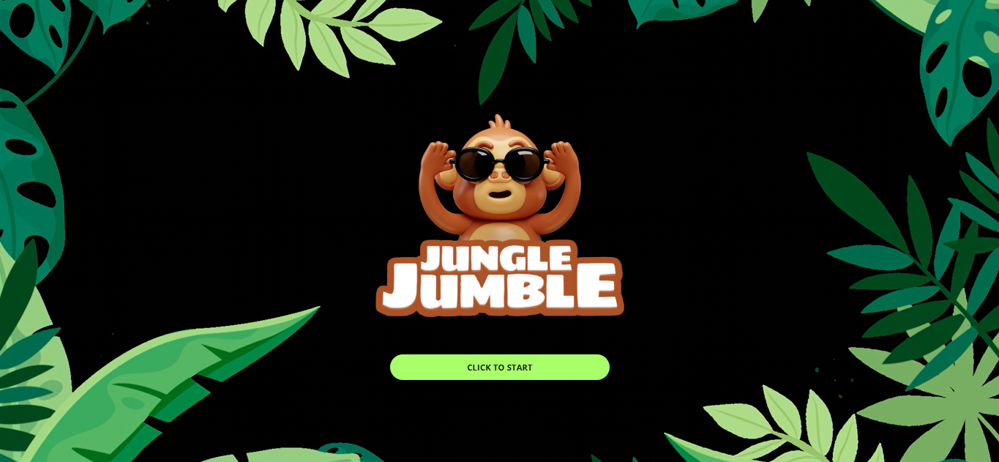 | 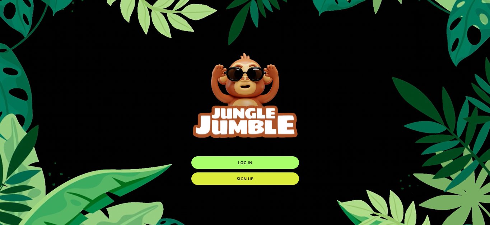 |
| Splash Screen | Login / Sign Up |
| 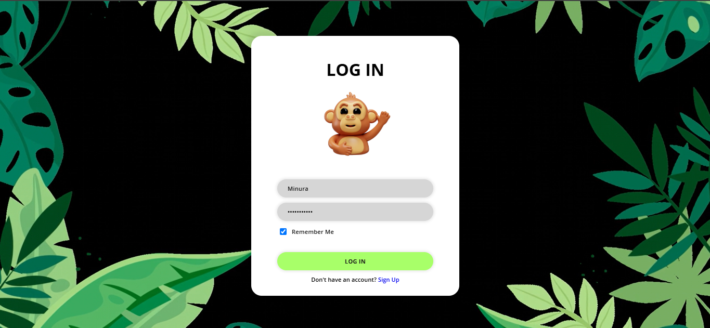 | 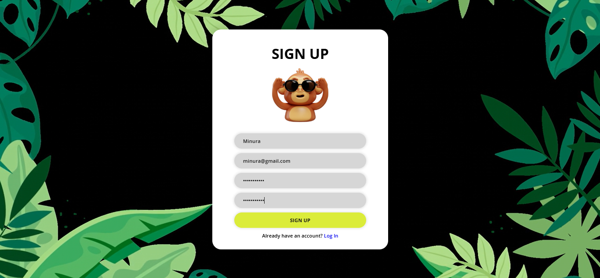 |
| Login | Sign Up |
| 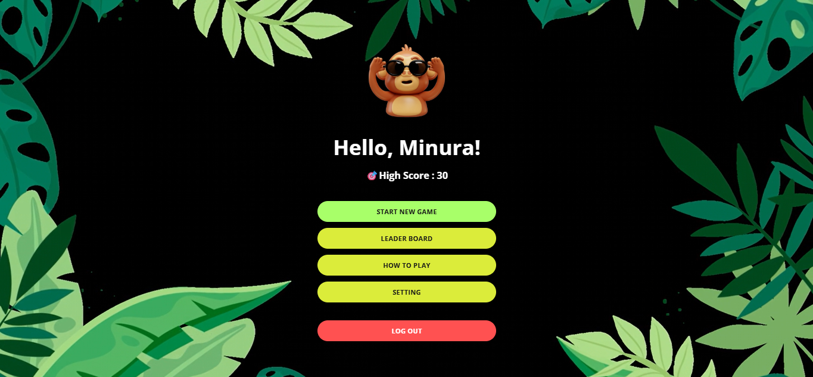 | 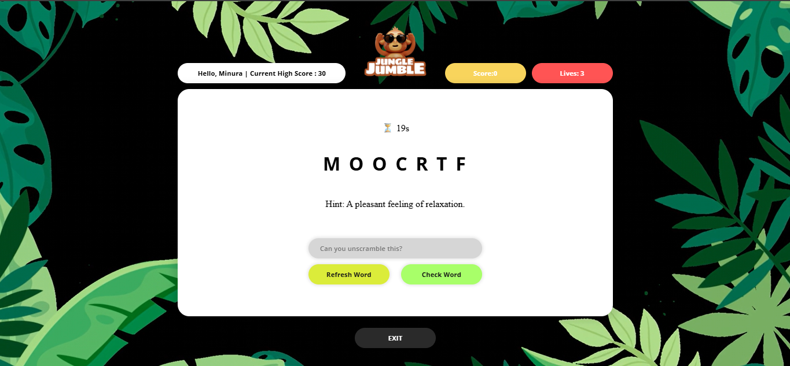 |
| Home | Gameplay |
| 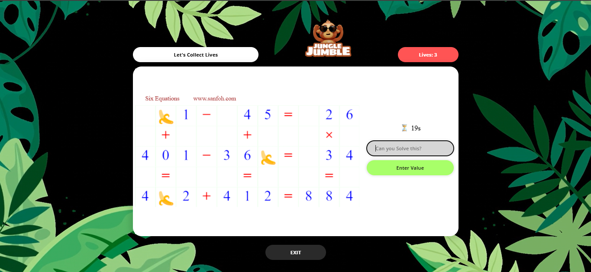 | 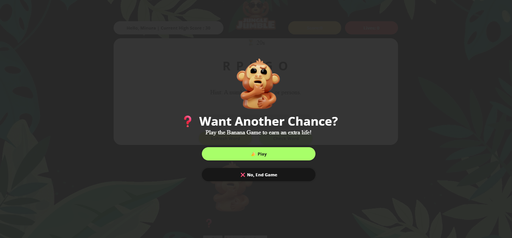 |
| Banana Bonus Game | Another Chance Prompt |
| 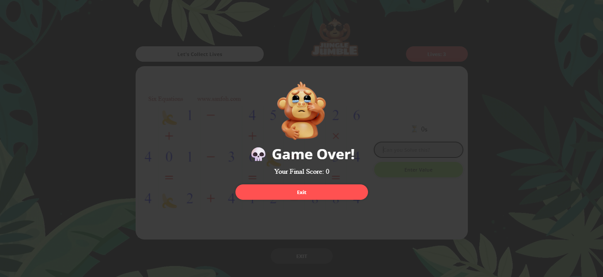 | 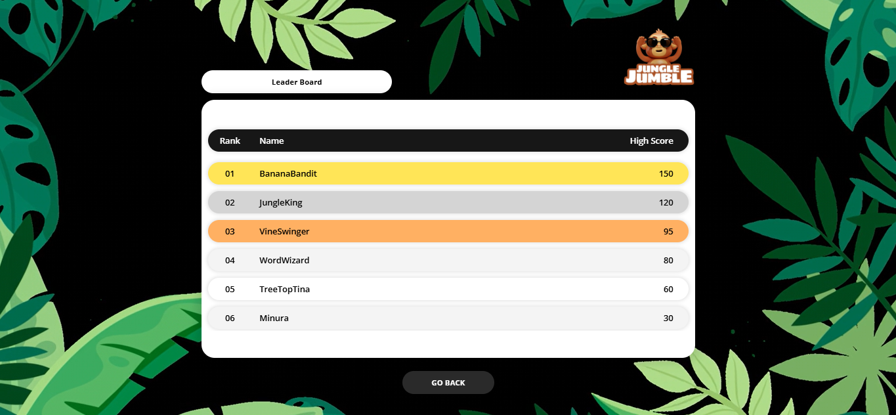 |
| Game Over | Leaderboard |
| 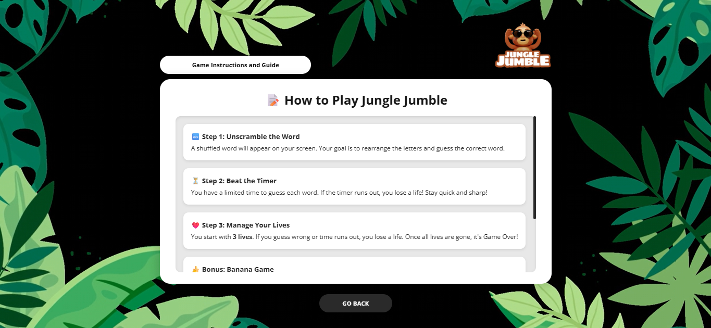 | 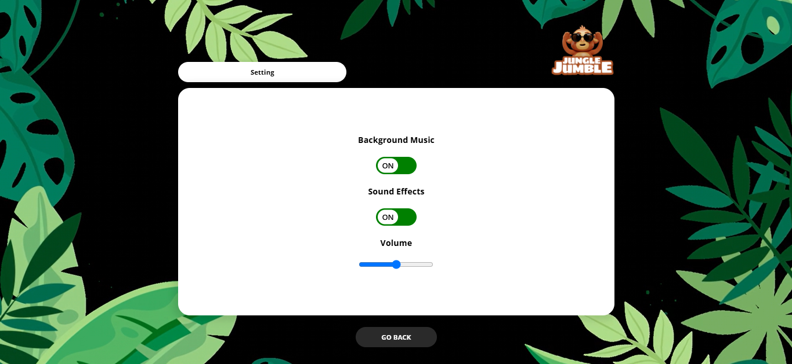 |
| How to Play | Settings |

---

## 🎮 How to Play

1. **Sign Up / Log In**
   - Register or log in using a username and password.
   - Your progress and high scores are saved.

2. **Guess the Word**
   - A scrambled word and its hint are shown.
   - Enter the correct word to earn points.
   - Wrong guesses reduce your lives.

3. **Lives System**
   - You start with 3 lives.
   - Lose all → prompted to play a **Banana Game** for a chance to earn 1 life.
   - Win = +1 life, Lose = Game Over.

4. **Leaderboard**
   - See how your score compares with others.

---

## ▶️ How to Run the Project Locally

To run Jungle Jumble on your local machine, follow these steps:

### ✅ Requirements:
- [WAMP Server](https://www.wampserver.com/) (or any local Apache + PHP + MySQL stack)
- A web browser (e.g. Chrome)

### 🧪 Steps:

1. **Clone or Download the Project**
   - Place the folder inside `www` (WAMP)
     Example path: `C:\wamp64\www\Jungle-Jumble`

2. **Start WAMP**
   - Open **WAMP Server** and make sure Apache and MySQL are running (icon shows green).

3. **Create the Database**
   - Open a terminal and run the schema and (optional) sample data scripts against MySQL:
     ```
     mysql -u root < database/jungle_jumble.sql
     mysql -u root < database/seed_sample_data.sql
     ```
   - Or import both files manually via `http://localhost/phpmyadmin`.
   - This creates the `jungle_jumble` database with a `users` table (`id`, `username`, `email`, `password`, `high_score`).

4. **Configure Database Connection**
   - Connection settings live in [config/db.php](config/db.php). Defaults match a fresh WAMP install (`root` with no password):
     ```php
     $host = "localhost";
     $db_name = "jungle_jumble";
     $username = "root";
     $password = "";
     ```
   - Update these values if your local MySQL uses different credentials.

5. **Run the Game**
   - Open your browser and go to:
     ```
     http://localhost/Jungle-Jumble/
     ```

### 🌱 Sample Accounts

`database/seed_sample_data.sql` adds 5 sample players (all use password `Password1!`) so the leaderboard has data right away:

| Username | High Score |
|---|---|
| BananaBandit | 150 |
| JungleKing | 120 |
| VineSwinger | 95 |
| WordWizard | 80 |
| TreeTopTina | 60 |

---

### 🛠️ Tech Stack

- **Frontend**: HTML, CSS, JavaScript
- **Backend**: PHP (MVC)
- **Database**: MySQL
- **Design**: Figma
- **Version Control**: Git

---

## 🌐 Custom API Implementation

### Purpose
Instead of storing word data in the local database, a **custom PHP-based API** is used to fetch shuffled words and hints dynamically at runtime.

### How it Works:

1. The frontend (`assets/js/gamescript.js`) calls the words API with `fetch()` on game start.
2. The API returns a random word and hint in JSON:
   ```json
   {
     "word": "planet",
     "hint": "A celestial body that orbits a star"
   }
   ```
3. The game shuffles the returned word's letters before displaying it to the player.
4. If the API is unreachable, a small built-in fallback word list keeps the game playable offline.

---
